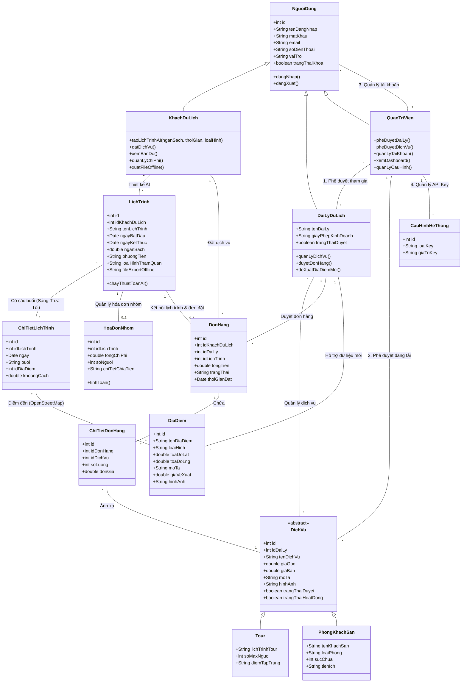

# Sơ Đồ Class Diagram Thiết Kế Hệ Thống Mới Nhất

```mermaid
classDiagram
    %% ================= KHỐI NGƯỜI DÙNG & QUYỀN =================
    class NguoiDung {
        +int id
        +String tenDangNhap
        +String matKhau
        +String email
        +String soDienThoai
        +String vaiTro
        +boolean trangThaiKhoa
        +dangNhap()
        +dangXuat()
    }

    class KhachDuLich {
        +taoLichTrinhAI(nganSach, thoiGian, loaiHinh)
        +datDichVu()
        +xemBanDo()
        +quanLyChiPhi()
        +xuatFileOffline()
    }

    class DaiLyDuLich {
        +String tenDaiLy
        +String giayPhepKinhDoanh
        +boolean trangThaiDuyet
        +quanLyDichVu()
        +duyetDonHang()
        +deXuatDiaDiemMoi()
    }

    class QuanTriVien {
        +pheDuyetDaiLy()
        +pheDuyetDichVu()
        +quanLyTaiKhoan()
        +xemDashboard()
        +quanLyCauHinh()
    }

    NguoiDung <|-- KhachDuLich
    NguoiDung <|-- DaiLyDuLich
    NguoiDung <|-- QuanTriVien

    %% ================= KHỐI DỊCH VỤ =================
    class DichVu {
        <<abstract>>
        +int id
        +int idDaiLy
        +String tenDichVu
        +double giaGoc
        +double giaBan
        +String moTa
        +String hinhAnh
        +boolean trangThaiDuyet
        +boolean trangThaiHoatDong
    }

    class Tour {
        +String lichTrinhTour
        +int soMaxNguoi
        +String diemTapTrung
    }

    class PhongKhachSan {
        +String tenKhachSan
        +String loaiPhong
        +int sucChua
        +String tienIch
    }

    DichVu <|-- Tour
    DichVu <|-- PhongKhachSan

    %% ================= KHỐI LỊCH TRÌNH & ĐỊA ĐIỂM =================
    class LichTrinh {
        +int id
        +int idKhachDuLich
        +String tenLichTrinh
        +Date ngayBatDau
        +Date ngayKetThuc
        +double nganSach
        +String phuongTien
        +String loaiHinhThamQuan
        +String fileExportOffline
        +chayThuatToanAI()
    }

    class ChiTietLichTrinh {
        +int id
        +int idLichTrinh
        +Date ngay
        +String buoi
        +int idDiaDiem
        +double khoangCach
    }

    class DiaDiem {
        +int id
        +String tenDiaDiem
        +String loaiHinh
        +double toaDoLat
        +double toaDoLng
        +String moTa
        +double giaVeXuat
        +String hinhAnh
    }

    %% ================= KHỐI ĐẶT HÀNG & CHI PHÍ =================
    class DonHang {
        +int id
        +int idKhachDuLich
        +int idDaiLy
        +int idLichTrinh
        +double tongTien
        +String trangThai
        +Date thoiGianDat
    }

    class ChiTietDonHang {
        +int id
        +int idDonHang
        +int idDichVu
        +int soLuong
        +double donGia
    }

    class HoaDonNhom {
        +int id
        +int idLichTrinh
        +double tongChiPhi
        +int soNguoi
        +String chiTietChiaTien
        +tinhToan()
    }

    %% ================= KHỐI CẤU HÌNH HỆ THỐNG =================
    class CauHinhHeThong {
        +int id
        +String loaiKey
        +String giaTriKey
    }

    %% ======== MỐI QUAN HỆ CỦA QUẢN TRỊ VIÊN (ADMIN) ========
    QuanTriVien "1" -- "*" DaiLyDuLich : 1. Phê duyệt tham gia
    QuanTriVien "1" -- "*" DichVu : 2. Phê duyệt đăng tải
    QuanTriVien "1" -- "*" NguoiDung : 3. Quản lý tài khoản
    QuanTriVien "1" -- "*" CauHinhHeThong : 4. Quản lý API Key

    %% ======== MỐI QUAN HỆ CỦA ĐẠI LÝ DU LỊCH (STAFF) ========
    DaiLyDuLich "1" -- "*" DichVu : Quản lý dịch vụ
    DaiLyDuLich "1" -- "*" DonHang : Duyệt đơn hàng
    DaiLyDuLich "1" -- "*" DiaDiem : Hỗ trợ dữ liệu mới

    %% ======== MỐI QUAN HỆ CỦA KHÁCH DU LỊCH (USER) ========
    KhachDuLich "1" -- "*" LichTrinh : Thiết kế AI
    KhachDuLich "1" -- "*" DonHang : Đặt dịch vụ

    %% ======== MỐI QUAN HỆ LÕI (CORE) ========
    LichTrinh "1" -- "*" ChiTietLichTrinh : Có các buổi (Sáng-Trưa-Tối)
    ChiTietLichTrinh "*" -- "1" DiaDiem : Điểm đến (OpenStreetMap)
    LichTrinh "1" -- "0..1" HoaDonNhom : Quản lý hóa đơn nhóm
    LichTrinh "1" -- "0..*" DonHang : Kết nối lịch trình & đơn đặt

    %% ======== MỐI QUAN HỆ GIỎ HÀNG (BOOKING) ========
    DonHang "1" -- "*" ChiTietDonHang : Chứa
    ChiTietDonHang "*" -- "1" DichVu : Ánh xạ
```
